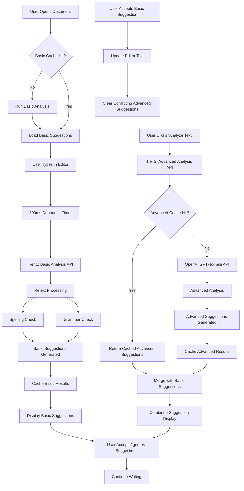
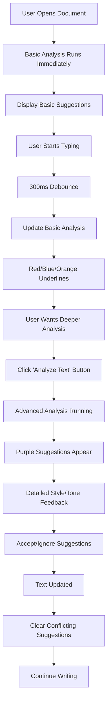

# 🎯 Two-Tiered Text Analysis Implementation Plan

## 📋 Requirements Summary

### **Tier 1: Basic Grammar & Spelling (Lightweight/Rule-Based)**

- **Tools**: Retext framework with plugins (spell, repeated-words, passive, equality, contractions)
- **Purpose**: Catch common typos, basic grammar errors, simple style issues
- **Execution**: Next.js backend API routes
- **Trigger**: On document load (if no cache), then 300ms debounce after user input
- **Performance**: <100ms response time
- **Text Threshold**: 4 characters minimum

### **Tier 2: Advanced Grammar, Style & AI Refinements (LLM-Powered)**

- **Tools**: OpenAI GPT-4o-mini API
- **Purpose**: Complex grammar, nuanced style, tone, clarity, AI-powered rephrasing
- **Execution**: Next.js backend API routes
- **Trigger**: Explicit user action ("Analyze Text" button)
- **Performance**: 2-5 seconds response time
- **Text Threshold**: 4 characters minimum

## 🔄 System Flow Diagram

## 🏗️ Implementation Components

### **1. Backend API Routes**

- `/api/analyze-basic` - Retext-based analysis (300ms debounced)
- `/api/analyze-advanced` - OpenAI-powered analysis (manual trigger)
- Enhanced caching system with separate cache keys

### **2. Frontend Components**

- `AnalysisToolbar` - Status indicators and controls
- `useTextAnalysis` - Hook for managing both analysis types
- `useDebouncedBasicAnalysis` - 300ms debounced basic analysis
- Enhanced suggestion display with type differentiation

### **3. Text Processing Pipeline**

- **Retext Analyzer**: Unified processing with 5 plugins
- **AI Analyzer**: Advanced GPT-4o-mini prompting
- **Suggestion Merger**: Smart combination without overlaps

### **4. Caching Strategy**

- **Basic Cache**: `basic_${text}` key with existing expiration policy
- **Advanced Cache**: `advanced_${text}` key with existing expiration policy
- **Cache Invalidation**: Clear both caches when text changes significantly

## 📊 User Experience Flow

## 🎨 Visual Design Specifications

### **Suggestion Color Coding**

- 🔴 **Red**: Spelling errors (basic)
- 🔵 **Blue**: Grammar issues (basic)
- 🟠 **Orange**: Style suggestions (basic)
- 🟣 **Purple**: Advanced AI suggestions

### **UI Elements**

- **Analysis Toolbar**: Shows status of both tiers
- **Suggestion Sidebar**: Categorized by type and tier
- **Status Badges**: Real-time analysis indicators
- **Clear Controls**: Separate clear options for each tier

## ⚡ Performance Targets

| Metric | Tier 1 (Basic) | Tier 2 (Advanced)
|-----|-----|-----
| **Response Time** | <100ms | 2-5 seconds
| **Debounce Delay** | 300ms | Manual trigger
| **Text Threshold** | 4 characters | 4 characters
| **Cache Hit Rate** | >80% | >60%
| **API Cost** | $0 | ~$0.01 per analysis

## 🔧 Technical Implementation Details

### **Role Separation Strategy**

- **Retext (Tier 1)**: Strictly focused on grammar and spelling only
- **GPT-4o-mini (Tier 2)**: Advanced style, tone, clarity, complex grammar

### **Error Handling**

- **Basic Analysis Failures**: Show error message and retry
- **Advanced Analysis Failures**: Continue with basic suggestions only
- **Cache Errors**: Graceful fallback to API calls

### **Suggestion Conflict Resolution**

- When basic suggestions are accepted → Clear conflicting advanced suggestions
- When advanced suggestions are accepted → Clear conflicting basic suggestions
- Smart merging to avoid duplicate suggestions

### **Cache Management**

- **Document Load**: Run basic analysis immediately if no cache detected
- **Text Changes**: Clear both basic and advanced caches when text changes significantly
- **Cache Keys**: Separate keys for each tier (`basic_${text}`, `advanced_${text}`)

## ❓ Questions & Potential Limitations

### **Questions for You:**

1. **Cost Management**: Should we add daily/monthly limits for advanced analysis to control OpenAI costs?
2. **Suggestion Prioritization**: When basic and advanced suggestions overlap, which should take priority?
3. **User Preferences**: Should users be able to disable certain types of suggestions (e.g., passive voice warnings)?
4. **Batch Processing**: For long documents, should we analyze in chunks or all at once?

### **Potential Limitations:**

1. **Retext Plugin Accuracy**: Rule-based analysis may have false positives
2. **OpenAI Rate Limits**: Advanced analysis might be throttled during high usage
3. **Cache Storage**: Large documents might exceed cache size limits
4. **Browser Performance**: Too many suggestions might slow down the editor
5. **Language Support**: Currently English-only (retext plugins are language-specific)

### **Mitigation Strategies:**

- **Accuracy**: Allow users to train/customize basic rules over time
- **Rate Limits**: Implement queuing system for advanced analysis
- **Cache Size**: Automatic cleanup of old/large cache entries
- **Performance**: Virtualized suggestion rendering for large documents
- **Languages**: Modular plugin system for future language support

## 🎯 Success Metrics

- **User Engagement**: >70% of users try advanced analysis
- **Suggestion Acceptance**: >40% acceptance rate for basic, >60% for advanced
- **Performance**: <300ms total response time for basic analysis
- **Cost Efficiency**: <$0.10 per user per month for AI analysis

## ✅ Implementation Status

### **Ready to Implement:**

1. ✅ **Requirements Clarified**: Role separation, triggers, error handling
2. ✅ **Technical Decisions**: Caching strategy, conflict resolution, performance targets
3. ✅ **Architecture Review**: Current implementation supports two-tier approach
4. ✅ **UI Design**: Color coding and component structure defined

### **Next Steps:**

1. **Phase 1**: Implement Retext-based basic analysis API
2. **Phase 2**: Create debounced basic analysis hook
3. **Phase 3**: Update suggestion types and UI components
4. **Phase 4**: Integrate advanced analysis with existing system
5. **Phase 5**: Testing and optimization

---

**Implementation Plan Finalized and Ready for Development** 🚀